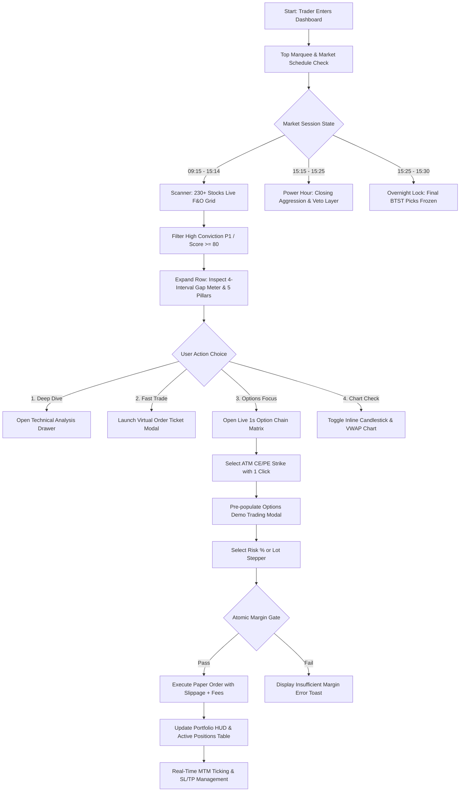

# TRADEXO — FRONTEND PRODUCT REQUIREMENTS DOCUMENT (PRD) & USER FLOW SPECIFICATION
**Document ID:** `PRD-FE-TRADEXO-V47`  
**System Class:** High-Conviction Institutional Momentum Engine, Overnight Gap Forecaster & Virtual Options Sandbox  
**Target Platform:** Web (Desktop & Mobile Responsive), Standalone PWA  
**Status:** Approved for Implementation (GSD Phase: Specifications & Architecture)  
**Author:** Quantitative Systems Engineering & Frontend Architecture Group  
**Cross-References:** [MASTER_SYSTEM_BLUEPRINT.md](file:///c:/Users/Smit%20Patel/STOCK%20BTST/QUANTHORIZON/docs/blueprints/MASTER_SYSTEM_BLUEPRINT.md) | [01_SCANNER_DASHBOARD.md](file:///c:/Users/Smit%20Patel/STOCK%20BTST/QUANTHORIZON/docs/blueprints/01_SCANNER_DASHBOARD.md) | [03_LIVE_1SEC_OPTION_CHAIN.md](file:///c:/Users/Smit%20Patel/STOCK%20BTST/QUANTHORIZON/docs/blueprints/03_LIVE_1SEC_OPTION_CHAIN.md) | [04_PAPER_TRADING_PORTFOLIO.md](file:///c:/Users/Smit%20Patel/STOCK%20BTST/QUANTHORIZON/docs/blueprints/04_PAPER_TRADING_PORTFOLIO.md) | [08_SYSTEM_HEALTH_AI_SENTINEL.md](file:///c:/Users/Smit%20Patel/STOCK%20BTST/QUANTHORIZON/docs/blueprints/08_SYSTEM_HEALTH_AI_SENTINEL.md)

---

## 1. EXECUTIVE SUMMARY & PRODUCT VISION

### 1.1 Vision Statement
**TRADEXO** (Quantitative Horizon) is an institutional-grade trading workstation engineered for active Indian market derivatives traders, quantitative analysts, and momentum specialists. It solves the critical challenge of **Overnight BTST (Buy Today Sell Tomorrow) / STBT (Sell Today Buy Tomorrow) risk** by synthesizing 5 mathematical confirmation pillars, institutional block deals ($> ₹25\text{ Cr}$), synthetic cumulative volume delta (CVD), and a 3:15–3:25 PM closing aggression veto gate into high-probability execution signals.

### 1.2 Core Product Tenets
1. **Sub-2ms Perceived Latency:** Zero waiting states for high-frequency workflows. All scanning, depth matrices, and option chains hydrate from local RAM cache or WebSocket tick streams.
2. **Deterministic Virtual Execution:** A 100% simulated, risk-free options and equity paper trading sandbox enforcing realistic slippage ($0.05\% - 0.10\%$), real-world exchange regulatory charges (STT + ₹20 flat brokerage), and live Mark-to-Market (MTM) ledgering.
3. **High-Density Institutional Aesthetics:** A modern, distraction-free, Bloomberg/macOS terminal aesthetic featuring Champagne Gold/Slate Dark mode, monospace numeric tabular alignment, color-coded delta indicators, and instant keyboard/pointer interactivity.
4. **Self-Healing Transparency:** Built-in AI Sentinel telemetry with a 10-phase waterfall health engine and rolling terminal console providing continuous visibility into broker feeds, memory caches, and database mutexes.

---

## 2. TARGET USER PERSONAS & PROBLEMS SOLVED

| Persona | Primary Goal | Critical Pain Point Solved | Key Features Leveraged |
| :--- | :--- | :--- | :--- |
| **P1: The BTST Swing Trader** | Catch 9:15 AM opening gap-ups/gap-downs with high win rate. | Overnight gap traps caused by retail illusions and fake late-session rallies. | 5-Pillar Matrix, Overnight Gap Predictor, 3:15 PM Closing Aggression Veto. |
| **P2: The F&O Derivatives Scalper** | Rapidly execute ATM Call/Put options on momentum breakouts. | High option execution latency and tedious manual strike/lot calculations. | Live 1-Second Option Chain, Click-to-Trade strike execution, Auto Lot Sizing. |
| **P3: The Quant & SMC Analyst** | Monitor institutional smart money footprints and market structure shifts. | Inability to track block deals ($> ₹25\text{ Cr}$) and order book depth imbalance in real time. | Synthetic CVD, 5-Level Depth Imbalance, Institutional Block Radar. |
| **P4: The Risk Manager & Student** | Test multi-leg strategies without risking live capital. | Unrealistic paper trading simulators that ignore slippage, fees, and margin requirements. | Virtual Sandbox (₹10L capital), Slippage & STT model, Dynamic MTM Ledger. |

---

## 3. SCOPE BOUNDARIES & BOUNDARY FENCES

### 3.1 In-Scope (v1.0 Institutional Baseline)
- Complete reactive single-page application (SPA) architecture across 14 dedicated workspaces.
- Live streaming ticker marquee tracking major indices (`NIFTY 50`, `BANK NIFTY`, `FINNIFTY`, `SENSEX`, `GIFT NIFTY`) and top picks.
- Real-time 230+ NSE F&O universe scanner with 12-column sortable, filterable data grid.
- High-frequency 1-second live option chain matrix with ATM auto-centering and click-to-trade integration.
- Full virtual paper trading engine with ₹10,00,000 capital, automated margin checks, SL/TP management, and trade history ledger.
- 7 built-in quantitative strategies with live execution status and AI Clarifier custom strategy builder.
- Institutional block deals radar, synthetic CVD charts, and 3:15–3:25 PM Power Hour closing aggression veto HUD.
- AI Sentinel diagnostics suite with 10-phase waterfall probes, 1-click self-healing, and live rolling terminal console.
- Dual-theme engine (Champagne Gold Dark Mode & Clean Slate Light Mode) and responsive mobile drawer navigation.

### 3.2 Out-of-Scope (Non-Goals & Anti-Features)
- **Live Real-Money Order Placement:** No direct order transmission to live exchange trading accounts (strictly simulated execution to protect user capital).
- **Social Trading / Chat Rooms:** No chat boards or unverified public signal sharing.
- **Crypto / Forex / Global Equities Trading:** Focused strictly on NSE India F&O universe and key macroeconomic benchmark indicators.

---

## 4. END-TO-END USER FLOWS



### Flow 1: High-Conviction Overnight BTST Discovery & Virtual Execution
1. **Trigger:** User navigates to `Scanner & Signals` (`data-section="scanner"`).
2. **Filter Action:** User clicks `P1 HIGH CONVICTION` filter pill or types a symbol in `#searchInput`.
3. **Inspection:** User clicks the candidate row (e.g., `#1 RELIANCE`, Score: 88%, Predicted Gap: `+1.85%`).
4. **Accordion Reveal:** Row expands to display:
   - Gap Probability Histogram (0-1%, 1-2%, 2-3%, 3%+).
   - 5-Pillar Score breakdown (Momentum, Delivery, Derivatives, Delivery Spike, Volume Surge).
   - 4-Button Action Bar (`ANALYSIS`, `⚡ PAPER TRADE`, `CHART`, `OPTION CHAIN`).
5. **Execution Trigger:** User clicks `⚡ PAPER TRADE`.
6. **Modal Hydration:** The `#optionsDemoTradeModal` opens immediately with pre-filled inputs:
   - Underlying: `RELIANCE` | Suggested Leg: `CALL (CE)`.
   - Strike Price auto-resolved to nearest ATM (e.g., `3000 CE`).
   - Official NSE Lot Size automatically populated (e.g., `250`).
7. **Order Configuration:** User adjusts lot stepper or selects `Risk 1.0% Capital`. Real-time calculations display estimated turnover, flat brokerage ($₹20$), STT ($0.1\%$), and total required margin.
8. **Confirmation:** User clicks `EXECUTE SIMULATED ORDER`.
9. **Feedback & Route:** Margin gate validates funds. Modal closes with success sound/toast. Notification badge updates on `Paper Trading Portfolio` sidebar tab.

### Flow 2: 1-Second Option Chain Inspection & Strike Scalping
1. **Trigger:** User selects `Live Option Chain` (`data-section="liveTrades"`) from sidebar or via `OPTION CHAIN` button from any scanner row.
2. **Telemetry Header:** Displays live underlying Spot LTP, Contract Lot Multiplier, Aggregate Put-Call Ratio (PCR), and Max Pain Strike.
3. **Expiry Selection:** User selects near-week or monthly expiry from dropdown.
4. **Live Polling:** UI establishes a 1-second polling cadence to `/api/option-chain/{symbol}`.
5. **Matrix Exploration:** Double-sided grid displays Call metrics on the left, Strike in the gold-highlighted center pillar, and Put metrics on the right.
6. **Click-to-Trade:** User clicks a specific Call LTP cell (highlighted green) or Put LTP cell (highlighted red).
7. **Instant Action:** Virtual Options modal immediately slides open with the exact clicked strike, expiry, and option type pre-configured.

### Flow 3: Power Hour (3:15–3:25 PM) Veto Gate & BTST Selection
1. **Time Trigger:** Clock hits 3:15 PM IST. Market Status Badge transitions to `POWER_HOUR (CLOSING AGGRESSION)` in shimmering gold.
2. **Navigation:** User navigates to `Order Flow & Closing Aggression` (`data-section="orderFlow"`).
3. **Telemetry Analysis:**
   - User reviews the 1-minute Synthetic CVD line chart.
   - User inspects the 5-Level Bid/Ask Depth Imbalance bar.
   - User reviews the 10-Minute Closing Aggression Delta bars.
4. **Veto Evaluation:**
   - If closing delta is positive ($> 0$) and depth confirms: Status displays `CONFIRMED (INSTITUTIONAL ACCUMULATION)`.
   - If late-session sell-off or distribution is detected: Status displays `VETOED BY ORDER FLOW (HIGH OVERNIGHT RISK)`.
5. **Overnight Lock:** At 3:25 PM, final high-conviction picks freeze into immutable state for next morning's 9:15 AM evaluation.

### Flow 4: Real-Time Position Management & Target/SL Modification
1. **Navigation:** User clicks `Paper Trading Portfolio` (`data-section="paperTrading"`).
2. **HUD Review:** User views top metric cards: Total Equity, Available Margin, Realized P&L, and Net Unrealized MTM ticking live.
3. **Position Inspection:** In the `Active Positions Table`, user observes individual position P&L, distance to Target 1, Target 2, and Stop Loss.
4. **Modification:** User clicks `MODIFY TARGET / SL` button.
   - `#editPositionModal` opens with sliders and numeric steppers.
   - User updates Stop Loss and Target 1, then clicks `SAVE MODIFICATIONS`.
   - Toast confirms atomic update to SQLite paper positions database.
5. **Liquidation:** User clicks `CLOSE POSITION`.
   - Confirmation dialog verifies intent.
   - Trade fills at current LTP minus simulated market exit slippage ($0.05\%$) and charges ($₹20 + STT$).
   - Trade moves to `Closed Trades Ledger`, releasing margin to available cash.

### Flow 5: Diagnostic Health Monitoring, AI Sentinel & Self-Healing
1. **Navigation:** User selects `System Health & AI Sentinel` (`data-section="systemHealth"`).
2. **Telemetry Overview:** User checks Composite Health Index multi-ring gauge ($0-100\%$) and countdown to next market milestone.
3. **Waterfall Inspection:** User filters 10-Phase Waterfall by `ISSUES`.
4. **Anomaly Resolution:**
   - If an anomaly is identified (e.g., SQLite lock contention or cache desync), user clicks `"TRIGGER AI SELF-HEAL NOW"`.
   - Sentinel executes autonomous remediation: purges stale mutex locks, recaches F&O symbols, reconnects WebSocket stream.
5. **Terminal Audit:** User opens the macOS-styled dark terminal console, selects `WARN/ERROR` tabs, and filters live logs to verify system stability.

---

## 5. INFORMATION ARCHITECTURE & SCREEN SPECIFICATIONS

```
TRADEXO APPLICATION SHELL
├── Global Header Bar
│   ├── Wordmark & Brand Logo
│   ├── Infinite Scrolling Top Marquee Track (#marqueeTrack)
│   ├── Market Schedule Status Badge (#topbarMarketStatusBadge)
│   ├── Force Scan Button (#scanBtn)
│   ├── Win Rate Analytics Button (#winRateBtn)
│   ├── Export CSV Watchlist Button (#exportCsvBtn)
│   └── Theme Switcher & Mobile Menu Trigger
├── Left Sidebar Navigation (#appSidebar - 14 Workspaces)
│   ├── 01. Scanner & Signals (data-section="scanner")
│   ├── 02. Index Intelligence (data-section="indices")
│   ├── 03. Live 1-Sec Option Chain (data-section="liveTrades")
│   ├── 04. Paper Trading Portfolio (data-section="paperTrading")
│   ├── 05. Strategies & SMC Engine (data-section="strategies")
│   ├── 06. Stocks News & Sentiment (data-section="stocksNews")
│   ├── 07. Global & Macro Telemetry (data-section="globalNews")
│   ├── 08. Institutional Flow & Blocks (data-section="institutionalFlow")
│   ├── 09. Order Flow & CVD Veto (data-section="orderFlow")
│   ├── 10. Accuracy & Win Rate (data-section="accuracy")
│   ├── 11. History & Signal Journal (data-section="history")
│   ├── 12. System Health & AI Sentinel (data-section="systemHealth")
│   ├── 13. Methodology Guide (data-section="guide")
│   └── 14. System Rules & Settings (data-section="rules")
└── Universal Modals & Overlays
    ├── Institutional Order Ticket Modal (#orderTicketModal)
    ├── Advanced Options Demo Trading Modal (#optionsDemoTradeModal)
    ├── Position SL / TP Edit Modal (#editPositionModal)
    ├── Fullscreen 1-Second Option Chain Modal (#optionChainModal)
    ├── Deep Technical Analysis Drawer (#modalAnalysisDrawer)
    └── Cinematic Platform Intro Video Overlay (#tradexoIntroOverlay)
```

---

## 6. SCOPED FUNCTIONAL REQUIREMENTS (GSD REQ-SPEC)

### 6.1 Global Shell & Navigation (REQ-NAV)
- **`REQ-NAV-001`**: The top ticker marquee must scroll continuously at 60fps across all major indices (`NIFTY 50`, `BANK NIFTY`, `FINNIFTY`, `SENSEX`, `GIFT NIFTY`) and Top 3 P1 candidates, updating price and percentage changes via WebSocket.
- **`REQ-NAV-002`**: Market status badge must automatically switch state based on Indian Standard Time:
  - `09:00 - 09:15 AM`: `PRE-MARKET` (Amber pill)
  - `09:15 AM - 03:14 PM`: `REGULAR_SESSION (LIVE)` (Emerald pill)
  - `03:14 - 03:25 PM`: `POWER_HOUR (CLOSING AGGRESSION)` (Gold pill with pulse animation)
  - `03:25 - 03:30 PM`: `CLOSING_LOCK (OVERNIGHT FREEZE)` (Purple pill)
  - `03:30 PM - 09:00 AM`: `MARKET_CLOSED (OFF-MARKET SNAPSHOT)` (Slate pill)
- **`REQ-NAV-003`**: Left sidebar must provide instant keyboard and touch routing across all 14 workspaces with persistent active highlighting, zero full-page reloads, and state persistence in `localStorage`.

### 6.2 Scanner & Signals Engine (REQ-SCAN)
- **`REQ-SCAN-001`**: Must render 230+ NSE F&O equities in a 12-column sortable table (`Rank`, `Ticker`, `Signal`, `Option`, `Priority`, `Predicted Gap`, `LTP`, `Vol Surge`, `RSI`, `Pillars`, `Conviction`, `Action`).
- **`REQ-SCAN-002`**: Top overview metric cards must display live counts for: `Total Scanned`, `P1 High Conviction`, `BTST Bullish`, and `STBT Bearish`.
- **`REQ-SCAN-003`**: Multi-filter toolbar must support one-click filtering for: `ALL`, `P1 HIGH CONVICTION`, `P2 MEDIUM`, `BTST (BUY)`, `STBT (SELL)`, and `TOP 5 ONLY`.
- **`REQ-SCAN-004`**: Clicking any table row must trigger an accordion expansion rendering:
  - 4-interval Gap Probability Meter ($0-1\%, 1-2\%, 2-3\%, 3\%+$) with exact historical sample counts.
  - 5-Pillar visual breakdown (scores normalized $0-100$).
  - 4-Button dedicated action bar (`ANALYSIS`, `⚡ PAPER TRADE`, `CHART`, `OPTION CHAIN`).

### 6.3 Index Intelligence & Macro Gate (REQ-IDX)
- **`REQ-IDX-001`**: Must render individual index cards for Nifty 50, Bank Nifty, FinNifty, Sensex, and GIFT Nifty showing LTP, Net Point Change, and Percentage Change.
- **`REQ-IDX-002`**: Must display real-time Put-Call Ratio (PCR) gauges with color-coded classification ($< 0.70$ Bearish, $0.70 - 1.30$ Neutral, $> 1.30$ Bullish) and Max Pain strikes.
- **`REQ-IDX-003`**: Must feature a Macro Pullback Gate indicator that evaluates GIFT Nifty dislocation, India VIX ($> 20.0$), Dow Futures, and USD/INR to display macro bias and automatically dampen overnight BTST scores when global sentiment is adverse.

### 6.4 Live 1-Second Option Chain & Matrix (REQ-OPT)
- **`REQ-OPT-001`**: Must query `/api/option-chain/{symbol}` at a 1-second cadence reading from zero-latency memory cache.
- **`REQ-OPT-002`**: Must display a double-sided matrix with CALLS (OI, Chg OI, Vol, LTP) on the left, Strike in center pillar, and PUTS (LTP, Vol, Chg OI, OI) on the right.
- **`REQ-OPT-003`**: The At-The-Money (ATM) strike row must be dynamically detected and visually highlighted in gold with auto-scroll centering.
- **`REQ-OPT-004`**: Clicking any Call or Put LTP cell must immediately launch the Options Demo Trading Modal with that exact symbol, strike, contract type, and official lot size pre-populated.

### 6.5 Paper Trading Portfolio & MTM Ledger (REQ-PTR)
- **`REQ-PTR-001`**: Virtual portfolio HUD must display: Total Equity, Available Cash, Invested Margin, Realized P&L, Net Unrealized MTM P&L, Total Brokerage Paid, and Win Rate %.
- **`REQ-PTR-002`**: Must execute an atomic margin check before creating any position:
  $$\text{Required Margin} = (\text{Entry Price} \times \text{Quantity}) + \text{Flat Brokerage (₹20)} + \text{STT (0.1\%)}$$
  Rejecting orders when available virtual cash is insufficient.
- **`REQ-PTR-003`**: Active positions table must continuously recalculate real-time floating MTM P&L and estimated exit charges for every tick.
- **`REQ-PTR-004`**: Provide `MODIFY TARGET / SL` dialog and one-click `CLOSE POSITION` liquidation with simulated market exit slippage ($0.05\%$).
- **`REQ-PTR-005`**: Closed trades must append to historical ledger with net realized profit, exit timestamp, and cumulative charges paid.

### 6.6 Strategies & SMC Playbook Engine (REQ-STR)
- **`REQ-STR-001`**: Must display 7 institutional strategy cards (VWAP Pullback, Breakdown Spike, ORB 30, OI Surge, Death Cross, Volatility Straddle, SMC Order Block Reversal) with live status tags, risk-reward ratios, and signal counters.
- **`REQ-STR-002`**: Must include a Natural-Language Custom Strategy AI Builder allowing traders to specify rules in plain English, verified via AI Clarifier service into executable parameters.

### 6.7 Institutional Flow & Order Flow Veto (REQ-OFL)
- **`REQ-OFL-001`**: Must highlight large block transactions exceeding $₹25\text{ Cr}$ with trade timestamp, quantity, execution price, and buyer/seller institutional tag.
- **`REQ-OFL-002`**: Must render a 1-minute Synthetic Cumulative Volume Delta (CVD) chart visualizing net buying vs. selling pressure leading up to 3:30 PM.
- **`REQ-OFL-003`**: Must display a 5-level order book bid-ask depth imbalance bar ($0-100\%$).
- **`REQ-OFL-004`**: Must present the 3:15–3:25 PM Closing Aggression Veto indicator, displaying `CONFIRMED` or `VETOED` based on final 10-minute delta bars.

### 6.8 Accuracy, History & Calibration (REQ-ACC)
- **`REQ-ACC-001`**: Must calculate historical win rate % across direction match and trade profit ($> +0.50\%$ after slippage and fees).
- **`REQ-ACC-002`**: Must display predicted vs. actual gap distribution histogram and 30-day rolling walk-forward pillar weight calibrations.
- **`REQ-ACC-003`**: Full signal journal must allow search, date-range filtering, and 1-click CSV export of historical BTST predictions.

### 6.9 AI Sentinel & System Health (REQ-SYS)
- **`REQ-SYS-001`**: Must render Composite Health Score multi-ring SVG meter ($0-100\%$) aggregating: Core Scheduling, Data Integrity, Frontend APIs, and Notifications/Journals.
- **`REQ-SYS-002`**: Must display 10-Phase Waterfall Engine cards with nominal vs. measured latencies, status badges (`OPTIMAL`, `WARN`, `DEGRADED`), and auto-heal hooks.
- **`REQ-SYS-003`**: Must feature a 1-click `"TRIGGER AI SELF-HEAL NOW"` button to clear database locks, restart dropped WebSockets, and refresh in-memory caches.
- **`REQ-SYS-004`**: Must provide a live streaming terminal console (`#0f172a` Bloomberg/macOS dark skin) with severity filters (`ALL`, `INFO`, `WARN`, `ERROR`), text query search, clipboard copy, and toggleable auto-scroll.

### 6.10 Universal Modals & Overlays (REQ-MOD)
- **`REQ-MOD-001`**: Equity Order Ticket (`#orderTicketModal`) supporting Market and Limit orders, lot sizing, and risk allocation steppers ($0.5\%, 1.0\%, 2.0\%, 3.0\%$).
- **`REQ-MOD-002`**: Options Demo Trading Ticket (`#optionsDemoTradeModal`) with dynamic strike selector centered around ATM, CE/PE toggle, official lot multiplier, and real-time margin computation.
- **`REQ-MOD-003`**: SL/TP Modification Modal (`#editPositionModal`) with live validation preventing Stop Loss placement above current price for long positions.
- **`REQ-MOD-004`**: Technical Breakdown Drawer (`#modalAnalysisDrawer`) sliding smoothly from the right, rendering pillar audit checklists and volume profiles.

---

## 7. REACTIVE DATA FLOW & STATE ARCHITECTURE

```
+-----------------------------------------------------------------------------------------+
|                                    BROWSER UI RUNTIME                                   |
+-----------------------------------------------------------------------------------------+
       |                                       ^                                    ^
       | User Inputs / Actions                 | High-Frequency DOM Updates         | Ticks
       v                                       |                                    |
+---------------------+             +----------------------+             +----------------+
| State Manager (DOM) |             | Local Cache (Memory) |             | WebSocket Bus  |
| - Active Section    |             | - Active Watchlist   |             | - Top Marquee  |
| - Filter Pills      |             | - Option Chain RAM   |             | - Price Ticks  |
| - Open Modals       |             | - Paper Positions    |             | - Health Logs  |
+---------------------+             +----------------------+             +----------------+
       |                                       ^                                    ^
       | REST Fetch (JSON)                     | Fast Response (<2ms)               | Stream
       v                                       |                                    |
+-----------------------------------------------------------------------------------------+
|                            FASTAPI BACKEND & IN-MEMORY CACHE                            |
|                       (`app.py`, `cache_layer.py`, `ws_broadcast.py`)                   |
+-----------------------------------------------------------------------------------------+
```

### 7.1 Polling Cadences & Fallback Thresholds
1. **Marquee & Real-time Prices:** WebSocket primary stream (`/ws/ticks`). Fallback to 5-second REST polling if WebSocket connection drops.
2. **Scanner Watchlist:** Hydrated immediately on page load, background refreshed every 30 seconds during market hours, or on-demand via `FORCE SCAN NOW`.
3. **Option Chain Matrix:** 1-second interval loop active only when Option Chain modal or workspace is in viewport. Suspends polling immediately when hidden to conserve network and CPU cycles.
4. **Paper Trading MTM:** 2-second interval loop to recompute floating P&L using the latest cached LTP prices.
5. **AI Sentinel Telemetry:** User-configurable auto-refresh cadence (`10s`, `30s`, `60s`, or `OFF`) with visual 1-second countdown circle.

---

## 8. DESIGN SYSTEM, TOKENS & VISUAL SPECIFICATION

### 8.1 Color Palette & Theme Tokens
The interface utilizes an institutional dark theme with Champagne Gold accents, complemented by an alternate Clean Slate light mode:

| Semantic Token | Dark Mode (Default) | Light Mode | Usage |
| :--- | :--- | :--- | :--- |
| `--bg-base` | `#0b0f19` (Deep Obsidian) | `#f8fafc` (Clean Slate) | Main viewport canvas background |
| `--bg-surface` | `#111827` (Card Surface) | `#ffffff` (Pure White) | Tables, cards, modals, drawers |
| `--border-subtle` | `#1f2937` (Dark Gray) | `#e2e8f0` (Light Border) | Card borders, grid lines, dividers |
| `--accent-gold` | `#d4af37` (Champagne Gold)| `#b89628` (Muted Gold) | Active tabs, ATM options, Rank #1 crown |
| `--bullish-green`| `#10b981` (Emerald) | `#059669` (Dark Green) | BTST signals, Call options, positive P&L |
| `--bearish-red` | `#f43f5e` (Rose/Red) | `#dc2626` (Crimson) | STBT signals, Put options, negative P&L |
| `--text-primary` | `#f9fafb` (High Contrast) | `#0f172a` (Deep Slate) | Headers, tickers, table values |
| `--text-muted` | `#9ca3af` (Cool Gray) | `#64748b` (Slate Gray) | Column headers, timestamps, labels |

### 8.2 Typography & Numeric Alignment
- **Interface Font:** Inter / System Sans-Serif (`font-sans`) for clean UI labels, navigation, and badges.
- **Financial Monospace Font:** JetBrains Mono / Roboto Mono (`font-mono`, `font-feature-settings: "tnum"`) strictly enforced across all currency, percentage, lot size, and timestamp figures to prevent jitter during real-time number streaming.

### 8.3 Interactive States & Micro-Animations
- **Button Active State:** Subtle scale transform (`active:scale-[0.98]`) with 150ms transition.
- **Row Hover:** Highlight background shift (`hover:bg-slate-800/50`) with pointer cursor.
- **Price Flash:** Green flash on uptick (`rgba(16, 185, 129, 0.25)`), Red flash on downtick (`rgba(244, 63, 94, 0.25)`) with 400ms fade.
- **Modal Backdrops:** Frosted glassmorphism (`backdrop-blur-md bg-black/60`).

---

## 9. EDGE CASES, ERROR HANDLING & RESILIENCY

| Edge Case / Failure Scenario | User Experience Impact | System Mitigation & Recovery |
| :--- | :--- | :--- |
| **WebSocket Stream Disconnected** | Price updates pause; ticker marquee stops moving. | Telemetry beacon pulses red (`RECONNECTING...`). UI automatically falls back to 5s REST polling while exponential backoff reconnection retries in background. |
| **Market Closed / Weekend Access** | No live ticks from NSE exchange. | Market status badge displays `MARKET_CLOSED`. UI seamlessly renders latest cached closing snapshot without throwing errors or showing blank screens. |
| **Insufficient Margin on Order** | User attempts to trade with more than available virtual funds. | Execution blocked instantly at client level. Input field highlights red with descriptive toast: `"Insufficient Virtual Funds (Required: ₹X, Available: ₹Y)"`. |
| **Option Chain Rapid Scrolling** | Heavy DOM re-rendering causing frame drops. | Virtualized DOM rows or throttled rendering loop. Center ATM row auto-centers upon symbol load. |
| **Network Latency Spike (>1000ms)** | Stale quotes during active paper trading. | Yellow warning pill appears: `"STALE DATA FEED (>1.2s)"`. Order ticket displays confirmation prompt with updated quote before submitting. |
| **SQLite Lock Contention** | System health logs or position writes temporarily busy. | AI Sentinel watchdog detects lock, initiates write-retry loop with WAL mode, or auto-purges stale lockfile via 1-click Self-Heal. |

---

## 10. GSD VERIFICATION MATRIX & QUALITY GATES

| REQ ID | Acceptance Test Description | Verification Command / Method | Success Criteria |
| :--- | :--- | :--- | :--- |
| **`REQ-NAV-001`** | Verify marquee scrolls continuously without DOM freeze. | Playwright / Headless Browser test. | Smooth 60fps translation, updates tick text on message. |
| **`REQ-SCAN-001`** | Verify 230+ F&O stocks render in 12 columns. | DOM check: `querySelectorAll('table tr').length >= 200`. | All 12 headers present; Rank, LTP, and Gap populated. |
| **`REQ-OPT-001`** | Verify 1-second option chain polling cadence. | Network inspection on `/api/option-chain/{symbol}`. | Exactly 1 request/sec when modal open; 0 req/sec when closed. |
| **`REQ-PTR-002`** | Test margin boundary rejection with zero cash. | Execute buy order with cost exceeding available cash. | Order rejected; error message displayed; balance unchanged. |
| **`REQ-PTR-003`** | Test real-time MTM calculation and fee deduction. | Execute virtual trade; simulate 1% price increase. | Gross MTM matches $(\Delta P \times Q)$; Net MTM includes fees. |
| **`REQ-SYS-003`** | Verify 1-click AI Sentinel self-healing action. | Click `#triggerSelfHealBtn`. | Response status 200; health score restores; log written. |
| **`REQ-MOD-004`** | Verify Technical Analysis Drawer slides smoothly. | Click `ANALYSIS` on any scanner row. | `#modalAnalysisDrawer` slides open; renders 5 pillars. |

---

## 11. IMPLEMENTATION ROADMAP & PHASE MAPPING

- **Phase 1: Shell, Navigation & Telemetry** (`REQ-NAV`, `REQ-MOD-004`)
  - Global topbar, live marquee ticker, dynamic IST market schedule pill, 14-item responsive sidebar navigation.
- **Phase 2: Scanner Engine & Multi-Filter Grid** (`REQ-SCAN`)
  - High-conviction cards, search & filter pills, 12-column table, 4-interval gap histogram, 4-button action bar.
- **Phase 3: Live 1-Second Option Chain** (`REQ-OPT`)
  - High-frequency memory-cached matrix, ATM center strike detector, click-to-trade strike binding.
- **Phase 4: Virtual Paper Trading & Portfolio HUD** (`REQ-PTR`, `REQ-MOD-001`, `REQ-MOD-002`)
  - ₹10L virtual cash ledger, atomic margin gates, dynamic slippage & regulatory cost model, live MTM calculations.
- **Phase 5: Order Flow, CVD & Closing Aggression Veto** (`REQ-OFL`)
  - Synthetic CVD chart, 5-level depth imbalance bar, 3:15–3:25 PM Power Hour veto logic.
- **Phase 6: AI Sentinel & Self-Healing Watchdog** (`REQ-SYS`)
  - Composite health score gauge, 10-phase waterfall cards, 1-click self-healing, rolling terminal console.
- **Phase 7: Intelligence, Strategies & Calibration** (`REQ-IDX`, `REQ-STR`, `REQ-ACC`, `REQ-HIS`)
  - Index sentiment & macro gate, 7 institutional playbooks, AI strategy builder, walk-forward calibration ledger.
